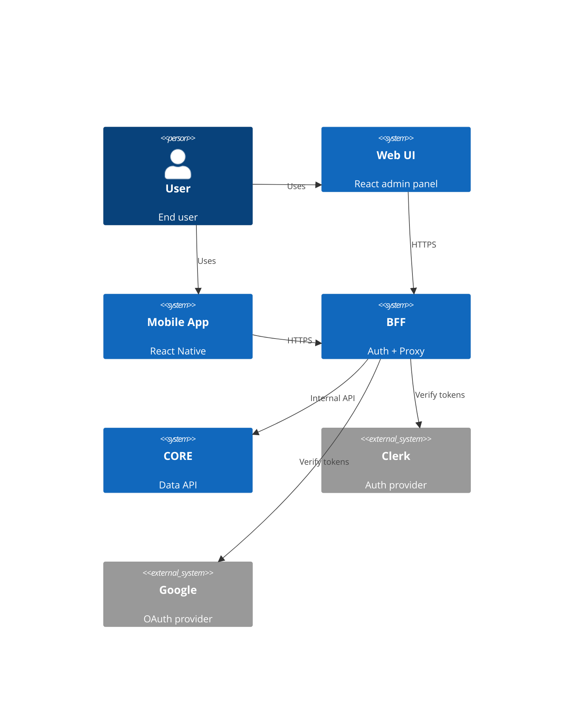
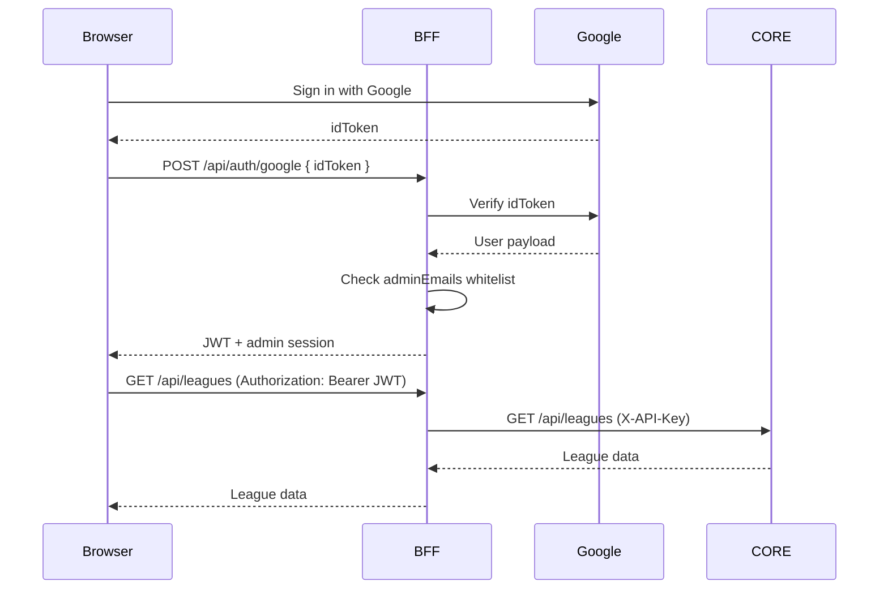
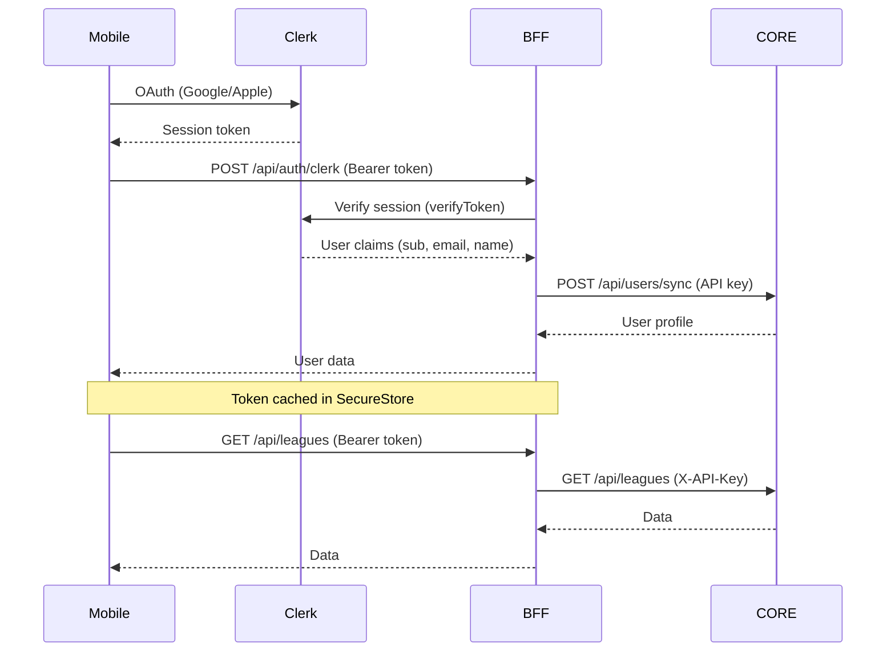
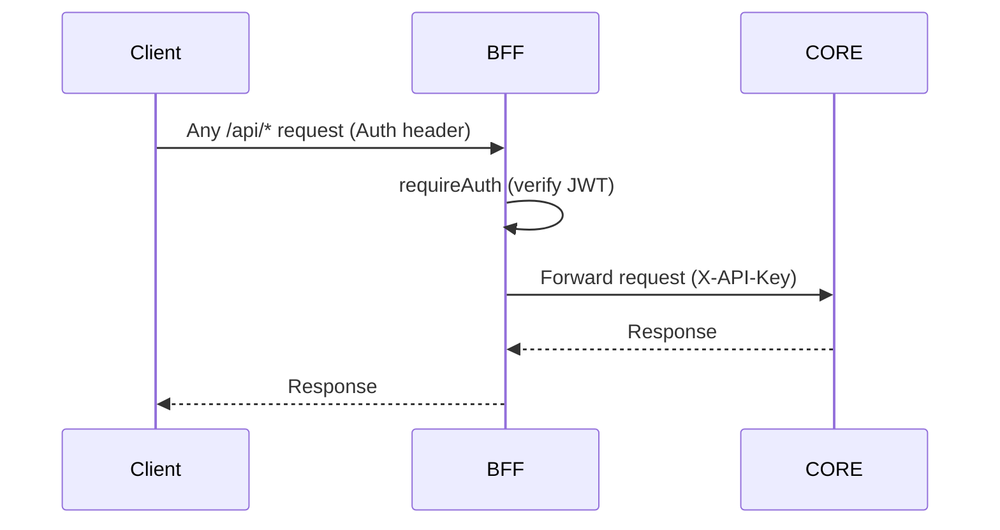

# BFF Architecture

## Overview

Backend-For-Frontend — Express + Google Auth + Clerk Auth + Proxy to CORE.
Single entry point for all clients (web-ui, mobile-app).

## System Context

## Auth Flow — Web UI (Google Sign-In)

## Auth Flow — Mobile App (Clerk)

## Request Flow — Proxy Pattern

## Architecture Decisions

### Why Clerk + Google Auth?
- **Web UI**: Google Sign-In directly (simple admin auth)
- **Mobile App**: Clerk handles Google + Apple OAuth, session management, token lifecycle
- Clerk's `@clerk/clerk-expo` provides native OAuth flows (not web-based redirects)

### Why Proxy Pattern?
- Single auth boundary (BFF handles all auth)
- CORE is a pure data API — no auth logic
- BFF can add caching, rate limiting, request transformation

### Why SecureStore?
- Clerk tokens stored in `expo-secure-store` (Keychain on iOS, EncryptedSharedPreferences on Android)
- NOT AsyncStorage — tokens must be encrypted

## Routes

| Method | Path | Auth | Description |
|--------|------|------|-------------|
| POST | /api/auth/google | None | Google Sign-In (web) |
| POST | /api/auth/clerk | Clerk | Clerk auth sync (mobile) |
| GET | /api/users/me | Clerk | Current user |
| PATCH | /api/users/me/preferences | Clerk | Update preferences |
| GET | /api/users/me/follows | Clerk | Get follows |
| POST | /api/users/me/follows | Clerk | Follow entity |
| DELETE | /api/users/me/follows/:id | Clerk | Unfollow |
| GET | /api/* | JWT | Proxy to CORE |
| POST | /api/* | JWT | Proxy to CORE |
| PATCH | /api/* | JWT | Proxy to CORE |
| DELETE | /api/* | JWT | Proxy to CORE |

## Environment Variables

| Variable | Description |
|----------|-------------|
| PORT | BFF port (default: 4001) |
| CORE_API_URL | CORE base URL |
| CORE_API_KEY | Shared secret with CORE |
| JWT_SECRET | JWT signing key (web-ui auth) |
| GOOGLE_CLIENT_ID | Google OAuth client ID |
| ADMIN_EMAILS | Comma-separated admin emails |
| CLERK_SECRET_KEY | Clerk API secret key |
| CLERK_PUBLISHABLE_KEY | Clerk publishable key |
| CORS_ORIGIN | Allowed CORS origin |
