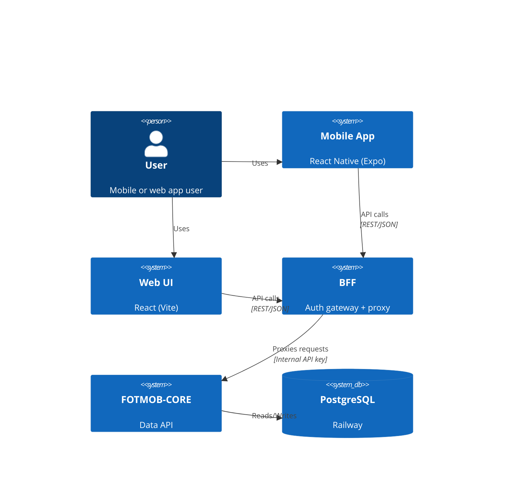
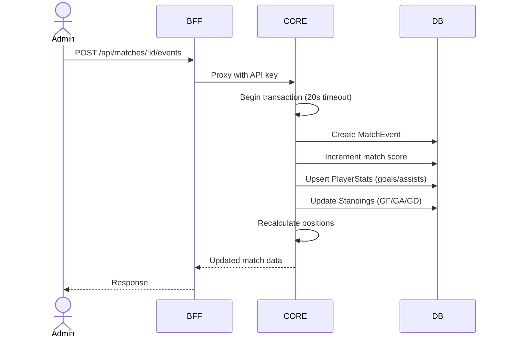
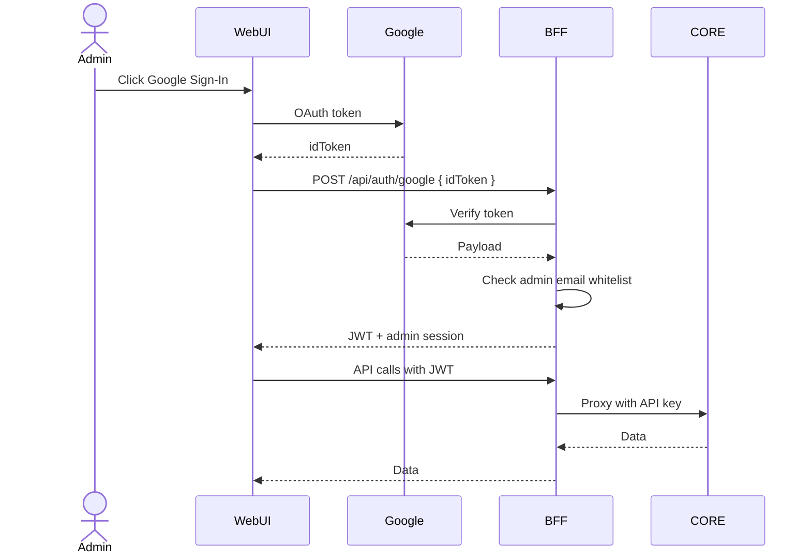
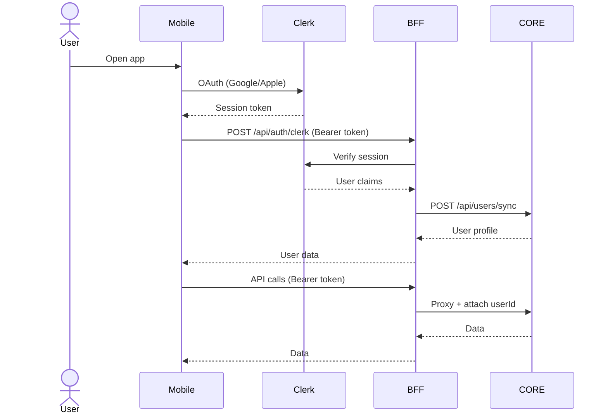
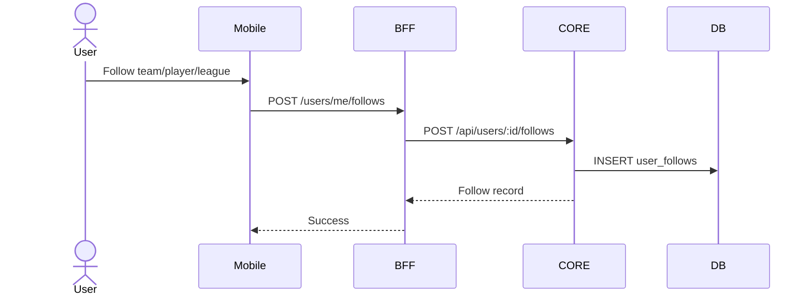

# FOTMOB-CORE Architecture

## Overview

Core Data API — Express + TypeScript + Prisma + PostgreSQL.
Serves all football data. Consumed exclusively by BFF via internal API key.

## System Context



## Data Flow — Admin Goal Cascade



## Data Flow — Google Sign-In (Web UI)



## Data Flow — Clerk Auth (Mobile App)



## Data Flow — User Follow



## Entity Relationship

```mermaid
erDiagram
    League ||--o{ Match : has
    League ||--o{ Standing : has
    League ||--o{ PlayerStats : has
    League ||--o{ News : has
    Team ||--o{ Match : home
    Team ||--o{ Match : away
    Team ||--o{ Player : squad
    Team ||--o{ Standing : has
    Team ||--o{ PlayerStats : has
    Team ||--o{ Transfer : from
    Team ||--o{ Transfer : to
    Player ||--o{ MatchEvent : scores
    Player ||--o{ PlayerStats : has
    Player ||--o{ Transfer : transfers
    Match ||--o{ MatchEvent : events
    User ||--o{ UserFollow : follows
```

## Models

| Model | Table | Key Fields |
|-------|-------|------------|
| League | leagues | name, slug, country, type, season |
| Team | teams | name, shortName, slug, logoUrl, country |
| Player | players | name, slug, position, teamId |
| Match | matches | homeTeamId, awayTeamId, leagueId, status, score |
| MatchEvent | match_events | matchId, teamId, playerId, type, minute |
| Standing | standings | leagueId, teamId, position, points |
| PlayerStats | player_stats | playerId, leagueId, season, goals, assists |
| Transfer | transfers | playerId, fromTeamId, toTeamId, fee |
| News | news | title, slug, content, category |
| Admin | admins | email, googleId, role |
| User | users | clerkId, email, preferences |
| UserFollow | user_follows | userId, entityType, entityId |

## Endpoints

### Public (no auth)
- `GET /api/leagues` — List leagues
- `GET /api/leagues/:id` — League detail
- `GET /api/leagues/:id/standings` — Standings
- `GET /api/teams` — List teams
- `GET /api/teams/:id` — Team detail with squad
- `GET /api/matches` — List matches (filter: leagueId, teamId, status)
- `GET /api/matches/:id` — Match detail
- `GET /api/matches/:id/events` — Match events
- `GET /api/players/:id` — Player detail
- `GET /api/transfers` — Transfers
- `GET /api/news` — News
- `GET /api/search?q=` — Search

### Admin (API key via X-API-Key header)
- `POST /api/admin/*` — All CRUD operations
- `POST /api/matches/:matchId/events` — Record event (goal cascade)
- `PATCH /api/matches/:matchId/status` — Update match status

### User (API key, userId passed by BFF)
- `POST /api/users/sync` — Create/update user
- `GET /api/users/:id` — Get user
- `PATCH /api/users/:id/preferences` — Update preferences
- `GET /api/users/:id/follows` — Get follows
- `POST /api/users/:id/follows` — Follow entity
- `DELETE /api/users/:id/follows/:followId` — Unfollow
